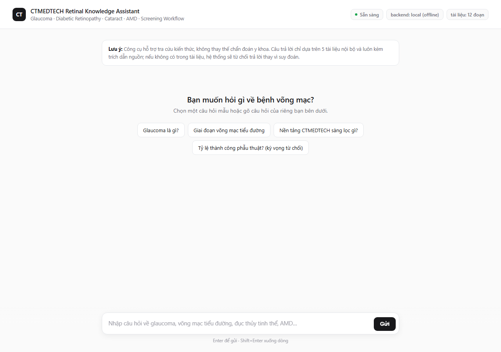
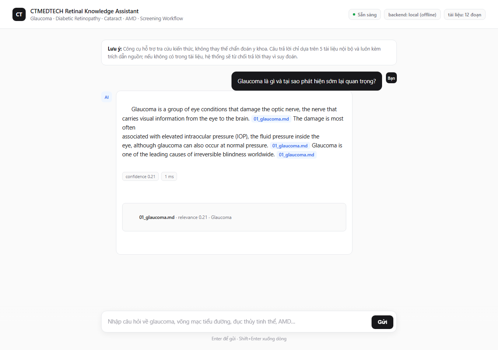
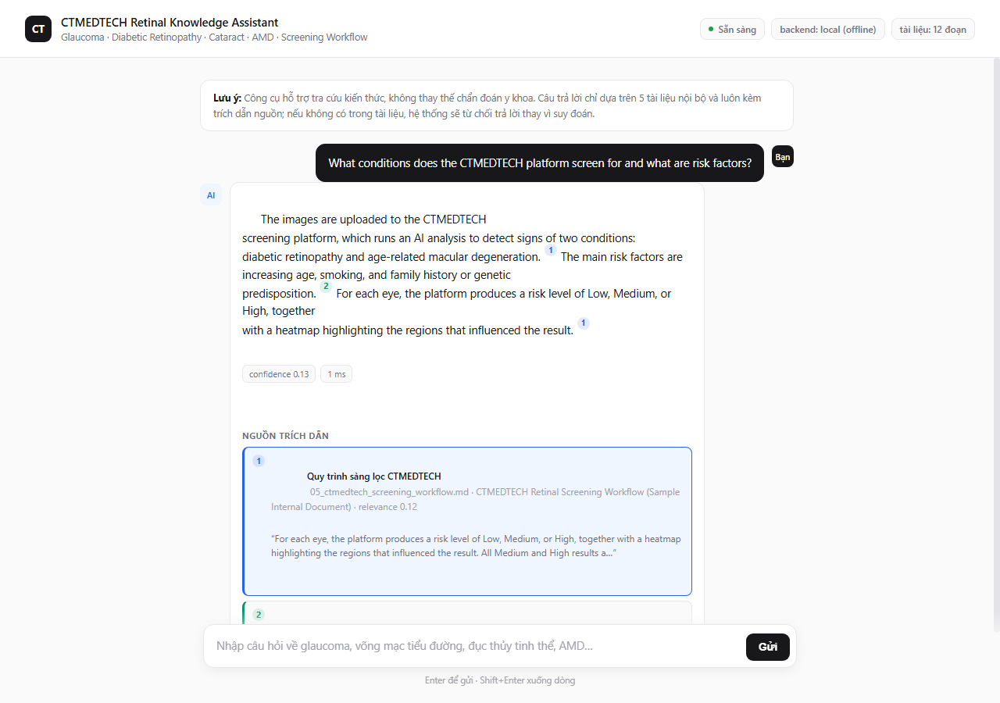
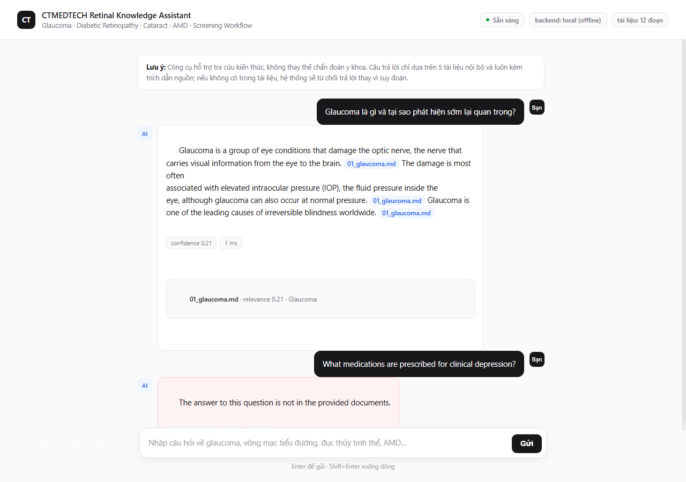

# CTMEDTECH AI Capability Assessment

**Candidate:** Ngo Tri Huy  
**Email:** ngohuy04022000@gmail.com  
**Track:** B — AI Knowledge Engineer  
**Date received:** 2026-06-29

---

## How to Run

### 1. Clone and install

```bash
git clone <your-repo-url>
cd ctmedtech-assessment-NgoTriHuy
pip install -r requirements.txt
```

### 2. Configure API key

```bash
cp .env.example .env
# Open .env and set your ANTHROPIC_API_KEY
```

### 3. Run the RAG system (Part 1)

```bash
python -m src.main
```

Interactive CLI — type a question, get a cited answer. Type `quit` to exit.

#### Run offline — no API key needed

Set `RAG_BACKEND=local` to answer from the retrieved passages without calling the LLM.
This runs the full pipeline (chunk → retrieve → cite) for demos, dev, and CI:

```bash
# macOS / Linux
RAG_BACKEND=local python -m src.main
```

```powershell
# Windows PowerShell
$env:RAG_BACKEND="local"; python -m src.main
```

The same flag works for the eval (`python -m src.tests.eval`) and the API
(`uvicorn src.api:app`). The offline backend refuses on truly out-of-scope
questions (nothing retrieved) but cannot do the LLM's *semantic* refusal
("relevant docs retrieved but the specific fact is absent") — use the `anthropic`
or `hf` backend for that.

#### Run with a local LLM — no API key, runs on your machine

A third backend (`RAG_BACKEND=hf`) runs a small instruct model **fully on this
machine** via Hugging Face Transformers — no API key, no network at query time.
It produces real generated (not just extractive) answers that cite sources and
refuse out-of-scope questions, so it satisfies the same hard constraints as the
Anthropic backend.

```bash
# 1. Install the extra deps (CPU works; a CUDA GPU is used automatically if present)
pip install torch transformers accelerate

# 2. Download the model once (~3 GB, into models/ which is git-ignored)
python -c "from huggingface_hub import snapshot_download; \
snapshot_download('Qwen/Qwen2.5-1.5B-Instruct', local_dir='models/Qwen2.5-1.5B-Instruct', \
allow_patterns=['*.json','*.safetensors','tokenizer*','merges.txt','vocab*'])"

# 3. Run any entry point with the hf backend
RAG_BACKEND=hf python -m src.main          # CLI
RAG_BACKEND=hf python -m src.tests.eval     # eval
RAG_BACKEND=hf uvicorn src.api:app          # API + web UI
```

The default model is `Qwen/Qwen2.5-1.5B-Instruct` (multilingual, small enough to
run on 8 GB VRAM or CPU). The first query loads the model (~10–30 s); subsequent
queries reuse it. Because a 1.5B model follows the citation format less reliably
than a frontier model, the backend reinforces the format with a one-shot example
**and** applies a deterministic safety net that appends the grounding sources if
the model ever omits them — so every non-refusal answer is always traceable.

### 4. Run the 5-question evaluation

```bash
python -m src.tests.eval
```

Runs 3 answerable + 2 must-refuse questions and prints PASS/FAIL for each.

### 5. Run as a REST API service (for delivery / demo)

```bash
uvicorn src.api:app --reload
```

Then open:
- **http://localhost:8000/** — web UI (chat-style, shows citations, confidence, latency)
- **http://localhost:8000/docs** — interactive Swagger UI

| Endpoint | Method | Purpose |
|----------|--------|---------|
| `/` | GET | Single-page web UI (`src/static/index.html`, no build step) |
| `/health` | GET | Liveness + index size + config (no API key needed) |
| `/query` | POST | `{"question": "...", "include_chunks": false}` → cited answer + confidence + latency |

The UI works with either backend — start with `RAG_BACKEND=local` to demo fully offline,
or set `ANTHROPIC_API_KEY` for LLM-generated answers. It polls `/health` every 15s to
show backend/readiness status in the header.

**Citation display:** each `[Source: filename]` in the answer is rendered as a small,
color-coded numbered badge (like a footnote), reused consistently for the same source.
A "Nguồn trích dẫn" (references) list below the answer shows, for every cited source:
a human-readable document label, the filename, section, relevance score, and the actual
excerpt backing the claim — so a claim can always be traced to the real passage, not just
a filename. Clicking a citation badge scrolls to and briefly highlights its reference card.

**Screenshots** (`docs/screenshots/`, captured running offline with `RAG_BACKEND=local`):

| Empty state | Answer with numbered citations | Citation click → highlighted source | Refusal state |
|---|---|---|---|
|  |  |  |  |

Example:

```bash
curl -s http://localhost:8000/query \
  -H "Content-Type: application/json" \
  -d '{"question":"What is glaucoma and why is early detection important?"}'
```

### 6. Run with Docker

```bash
docker build -t ctmedtech-rag .
docker run -e ANTHROPIC_API_KEY=sk-... -p 8000:8000 ctmedtech-rag
```

The image includes a `HEALTHCHECK` that polls `/health`.

### 7. Run the unit tests

```bash
pytest src/tests -v
```

No API key required for unit tests — chunker, retriever, config, generation logic
(mocked LLM), and the HTTP layer (mocked pipeline) are all tested without calling the API.

---

## Configuration

All tunables are environment variables with safe defaults (see `.env.example`):

| Variable | Default | Purpose |
|----------|---------|---------|
| `RAG_BACKEND` | `anthropic` | `anthropic` (API), `local` (offline extractive), or `hf` (on-device LLM) |
| `ANTHROPIC_API_KEY` | — | Required when `RAG_BACKEND=anthropic` |
| `RAG_HF_MODEL_DIR` | `models/Qwen2.5-1.5B-Instruct` | Local model dir for `RAG_BACKEND=hf` |
| `RAG_HF_MAX_NEW_TOKENS` | `400` | Max tokens generated by the local LLM |
| `ANTHROPIC_MODEL` | `claude-haiku-4-5-20251001` | LLM model |
| `RAG_MAX_TOKENS` | `600` | Max answer tokens |
| `RAG_TEMPERATURE` | `0.0` | Determinism |
| `RAG_REQUEST_TIMEOUT` | `30` | Per-request timeout (s) |
| `RAG_MAX_RETRIES` | `3` | SDK auto-retry on 429/5xx/network |
| `RAG_TOP_K` | `5` | Chunks retrieved per query |
| `RAG_MAX_PER_SOURCE` | `2` | Diversity cap per document |
| `RAG_MIN_SCORE` | `0.01` | Relevance floor for retrieval |
| `RAG_LOCAL_MIN_CONFIDENCE` | `0.12` | Offline backend refuses below this top score |
| `RAG_CHUNK_SIZE` | `700` | Target chunk size (chars) |
| `RAG_LOG_LEVEL` | `INFO` | Logging verbosity |

---

## Where Each Answer Lives

| Part | Location |
|------|----------|
| Part 1 — RAG System | `src/` |
| Part 2 — Debug | `part2_debug.md` |
| Part 3 — Hallucination | `part3_hallucination.md` |
| Part 4 — Reflection | `part4_reflection.md` |
| Process Log | `PROCESS_LOG.md` |
| Reusable AI Skill | `skills/SKILL.md` |

---

## Architecture (Part 1 — Track B RAG)

```
Track_B_RAG_source_documents/   ← 5 knowledge-base markdown files
src/
  config.py      ← centralized Settings (env vars) + structured logging
  chunker.py     ← loads docs, section-aware chunking with metadata
  retriever.py   ← TF-IDF (1–2 gram, sublinear) + cosine similarity, top-k retrieval
  generator.py   ← Anthropic Claude API: cited answers, refusal, retries, error handling
  local_llm.py   ← on-device LLM backend (RAG_BACKEND=hf): loads a small HF model once
  rag.py         ← orchestrator: chunker → retriever → generator (3 backends)
  main.py        ← interactive CLI (shows sources, scores, confidence, latency)
  api.py         ← FastAPI service: /, /query, /health, /docs
  static/
    index.html   ← single-page web UI (chat-style, no build step)
  tests/
    test_rag.py       ← unit tests (mocks LLM; edge cases + config + errors + resilience)
    test_api.py       ← HTTP-layer tests (mocked pipeline; no API calls)
    test_local_llm.py ← on-device backend tests (citation safety net; no model load)
    eval.py           ← 5-question integration eval (any backend)
Dockerfile       ← container image running the API
```

**Retrieval:** TF-IDF (scikit-learn) with 1–2 grams and sublinear TF (BM25-style term
saturation). The section heading is indexed alongside body text to sharpen document
routing. Lightweight, no embedding API needed for a 5-document corpus. Upgrade path:
replace `TFIDFRetriever` with `sentence-transformers` + FAISS.

**Generation:** `claude-haiku-4-5-20251001` by default (configurable). The system prompt
enforces citation format and an exact refusal phrase. The Anthropic client is created
once per pipeline (cached) with automatic retries and a request timeout; a final failure
is wrapped in `GenerationError` and surfaced cleanly to the CLI/API.

### What changed in this hardening pass

- **Efficiency:** the Anthropic client is now created once and reused (previously a new
  client was built on every query); the retriever indexes section headings for better
  routing; section-aware chunking merges one-line fragments into coherent context.
- **Reliability:** request timeout + SDK auto-retry on 429/5xx/network; clean error
  surfacing; structured logging; centralized, validated configuration.
- **Features:** FastAPI REST service (`/query`, `/health`, Swagger `/docs`), Docker image
  with healthcheck, per-answer confidence/latency/refusal flags, richer CLI output.
- **Tests:** expanded from 13 to 29 (chunker sections, config, generator error handling,
  and the HTTP layer) — all pass without an API key.

---

## Hard Constraints Met

| Requirement | How |
|-------------|-----|
| Answers cite source passage | System prompt enforces `[Source: filename]`; the on-device `hf` backend adds a deterministic safety net that guarantees a citation is always present |
| Refuse when answer not present | Two-level: score=0 → empty retrieval → immediate refusal; score>0 → LLM instructed to refuse if context doesn't contain answer |
| Cross-document questions | top_k=5 with per-source diversity limit pulls from multiple docs |
| 5-question eval (3 answerable, 2 refuse) | `src/tests/eval.py`, runnable against any backend |

**Three interchangeable backends**, all satisfying the citation + refusal constraints:
`anthropic` (Claude API), `hf` (small LLM on your machine, no key), and `local`
(offline extractive, no key, no model download — a zero-dependency demo/CI mode).
